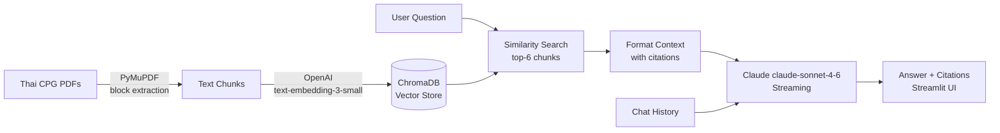

# 🏥 Thai Clinical Guideline Assistant

> **AI-powered Q&A over Thai Clinical Practice Guidelines** — Instant answers with source citations for Diabetes, Dyslipidemia, and Hypertension guidelines.

[](https://your-app.streamlit.app)
[](https://python.org)
[](https://langchain.com)

---

## 🩺 Problem

Thai clinical practice guidelines (CPGs) are critical references for healthcare professionals, but each document runs 100–300 pages of dense medical Thai. Finding a specific recommendation requires manually searching through multiple guidelines — or not finding it at all.

This assistant uses **Retrieval-Augmented Generation (RAG)** to enable natural-language Q&A over 3 Thai CPGs, returning accurate answers with page-level source citations in seconds.

---

## ✨ Features

- **Natural language Q&A** in Thai and English over 3 clinical guidelines
- **Page-level citations** — every answer shows which guideline and which page
- **Multi-turn conversation** — follow-up questions reference prior context
- **Source chunk viewer** — see the exact retrieved passages in the sidebar
- **Out-of-scope detection** — gracefully handles questions outside the guidelines

---

## 🏗️ Architecture



---

## 🛠️ Tech Stack

| Component | Technology | Why |
|---|---|---|
| **LLM** | Claude claude-sonnet-4-6 (Anthropic) | Best Thai language understanding, streaming |
| **Embeddings** | OpenAI text-embedding-3-small | Multilingual, fast, cost-effective (<$0.10 for 3 PDFs) |
| **Vector Store** | ChromaDB | Persistent local store, zero infrastructure |
| **PDF Parsing** | PyMuPDF | Block-mode extraction preserves Thai paragraph structure |
| **LLM Framework** | LangChain | Industry-standard RAG chains |
| **UI** | Streamlit | Rapid chat interface, easy deployment |

---

## 📋 Clinical Guidelines Covered

| Disease | แนวทางเวชปฏิบัติ |
|---|---|
| 🩸 **Diabetes** | โรคเบาหวาน (T2DM) |
| 💊 **Dyslipidemia** | ภาวะไขมันในเลือดผิดปกติ |
| 🫀 **Hypertension** | โรคความดันโลหิตสูง |

---

## 🚀 Quick Start

### Prerequisites
- Python 3.11+
- Anthropic API key
- OpenAI API key

### Installation

```bash
# 1. Clone the repository
git clone https://github.com/your-username/thai-clinical-rag.git
cd thai-clinical-rag

# 2. Create virtual environment
python -m venv venv
source venv/bin/activate  # Windows: venv\Scripts\activate

# 3. Install dependencies
pip install -r requirements.txt

# 4. Configure environment variables
cp .env.example .env
# Edit .env and add your API keys
```

### Add your PDFs

Place your Thai CPG PDFs in the `data/` directory:
```
data/
├── diabetes.pdf
├── dyslipidemia.pdf
└── hypertension.pdf
```

### Run ingestion (one-time setup)

```bash
python -m src.ingest
```

This processes the PDFs, creates embeddings, and saves them to ChromaDB. Takes ~2–3 minutes on first run.

### Launch the app

```bash
streamlit run app.py
```

Open [http://localhost:8501](http://localhost:8501) in your browser.

---

## 💬 Example Questions

| Thai | English |
|---|---|
| ค่าเป้าหมาย HbA1c สำหรับผู้ป่วยเบาหวานชนิดที่ 2 ควรอยู่ที่เท่าไหร่? | What is the HbA1c target for T2DM patients? |
| ความดันโลหิตเป้าหมายในผู้ป่วยความดันโลหิตสูงคือเท่าไหร่? | What is the blood pressure target for hypertension? |
| เมื่อไหร่ควรเริ่มยา statin ในผู้ป่วยไขมันในเลือดสูง? | When should statin therapy be initiated for dyslipidemia? |
| ผู้ป่วยเบาหวานที่มีความดันโลหิตสูงควรได้รับยาอะไร? | What medications are recommended for diabetic patients with hypertension? |
| What are the LDL-C targets for high cardiovascular risk patients? | — |

---

## ☁️ Deployment on Streamlit Community Cloud

1. Push your repo to GitHub (without the `chroma_db/` directory and API keys)
2. Go to [share.streamlit.io](https://share.streamlit.io) and connect your repo
3. Add secrets in **Settings → Secrets**:
   ```toml
   ANTHROPIC_API_KEY = "sk-ant-..."
   OPENAI_API_KEY = "sk-..."
   ```
4. **Important**: The `chroma_db/` directory needs to be pre-built and committed, or the ingestion step must run on first deploy. See [Deployment Notes](#deployment-notes).

### Deployment Notes

For Streamlit Cloud, commit the pre-built `chroma_db/` directory (remove from `.gitignore` temporarily, build it locally, commit, then re-add to `.gitignore`). This avoids running the ingestion step on every cold start.

---

## 🔧 Configuration

All settings are in `.env`:

| Variable | Default | Description |
|---|---|---|
| `ANTHROPIC_API_KEY` | — | Anthropic API key |
| `OPENAI_API_KEY` | — | OpenAI API key (for embeddings) |
| `LLM_MODEL` | `claude-sonnet-4-6` | Claude model |
| `EMBEDDING_MODEL` | `text-embedding-3-small` | OpenAI embedding model |
| `CHUNK_SIZE` | `900` | Characters per chunk |
| `CHUNK_OVERLAP` | `200` | Overlap between chunks |
| `RETRIEVAL_TOP_K` | `6` | Number of chunks retrieved per query |

---

## 🧠 Design Decisions

**Why not split by Thai word boundaries?**  
PyThaiNLP word tokenization on 30MB+ medical PDFs takes 10–15 minutes. RecursiveCharacterTextSplitter at 900 characters with 200-char overlap is fast (seconds), preserves enough context around medical terms, and the embedding model handles Thai without word-level tokenization.

**Why OpenAI embeddings instead of a local Thai model?**  
`text-embedding-3-small` is genuinely multilingual and handles Thai-Latin mixed text (e.g., HbA1c, eGFR, ACEI) naturally. The entire 3-PDF corpus costs under $0.10 to embed. Local Thai models (WangchanBERTa, BGE-M3) require 500MB+ downloads and GPU/MPS setup — not worth the friction for a portfolio build.

**Why PyMuPDF block mode?**  
`page.get_text("blocks")` returns separate text blocks per column/paragraph rather than a single flat string. This is critical for Thai clinical PDFs, which use multi-column layouts and mix Thai paragraphs with Latin tables.

**Why LangChain without LangGraph?**  
A clean, readable LangChain RAG chain is more maintainable and portfolio-readable than a LangGraph state machine for this straightforward retrieval task. LangGraph adaptive retrieval (retrieve → grade → rewrite loop) is the clear next step.

---

## 🔮 Future Enhancements

- [ ] **LangGraph adaptive RAG** — retrieve → grade relevance → rewrite query loop
- [ ] **BM25 hybrid search** — combine sparse keyword + dense vector retrieval for Thai medical terms
- [ ] **Disease-specific routing** — keyword-based routing to filter retrieval by disease
- [ ] **Fine-tuned Thai embeddings** — domain-adapted embeddings on Thai medical corpus
- [ ] **Multi-user sessions** — proper user isolation with session IDs
- [ ] **PDF upload UI** — allow users to add new guidelines without code changes
- [ ] **Evaluation dashboard** — RAGAS metrics (faithfulness, context precision, answer relevance)

---

## ⚠️ Disclaimer

This tool provides information from clinical practice guidelines for **educational and reference purposes only**. It is not a substitute for professional medical judgment. Always consult a qualified healthcare professional for clinical decisions.

---

## 📄 License

MIT License — see [LICENSE](LICENSE) for details.
