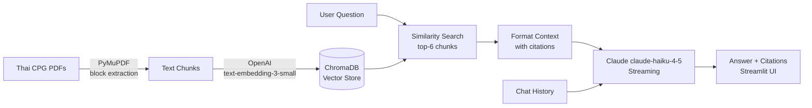

# 🏥 Thai Clinical Guideline Assistant

> **AI-powered Q&A over Thai Clinical Practice Guidelines** — Instant answers with source citations for Diabetes, Dyslipidemia, and Hypertension guidelines.

---

## 🩺 Problem

Thai clinical practice guidelines (CPGs) are critical references for healthcare professionals, but each document runs 100–300 pages of dense medical Thai. Finding a specific recommendation requires manually searching through multiple guidelines — or not finding it at all.

This assistant uses **Retrieval-Augmented Generation (RAG)** to enable natural-language Q&A over 3 Thai CPGs, returning accurate answers with page-level source citations in seconds.

---

## ✨ Features

- **Natural language Q&A** in Thai and English over 3 clinical guidelines
- **Page-level citations** — every answer shows which guideline and which page
- **Multi-turn conversation** — follow-up questions reference prior context
- **Source chunk viewer** — see the exact retrieved passages in the sidebar
- **Out-of-scope detection** — gracefully handles questions outside the guidelines

---

## 🏗️ Architecture

---

## 🛠️ Tech Stack

| Component | Technology | Why |
|---|---|---|
| **LLM** | Claude claude-haiku-4-5 (Anthropic) | Thai language understanding, streaming |
| **Embeddings** | OpenAI text-embedding-3-small | Multilingual, fast, cost-effective (<$0.10 for 3 PDFs) |
| **Vector Store** | ChromaDB | Persistent local store, zero infrastructure |
| **PDF Parsing** | PyMuPDF | Block-mode extraction preserves Thai paragraph structure |
| **LLM Framework** | LangChain | Industry-standard RAG chains |
| **UI** | Streamlit | Rapid chat interface, easy deployment |

---

## 📋 Clinical Guidelines Covered

| Disease | แนวทางเวชปฏิบัติ |
|---|---|
| 🩸 **Diabetes** | โรคเบาหวาน (T2DM) |
| 💊 **Dyslipidemia** | ภาวะไขมันในเลือดผิดปกติ |
| 🫀 **Hypertension** | โรคความดันโลหิตสูง |

## ⚠️ Disclaimer

This tool provides information from clinical practice guidelines for **educational and reference purposes only**. It is not a substitute for professional medical judgment. Always consult a qualified healthcare professional for clinical decisions.

---

## 📄 License

MIT License — see [LICENSE](LICENSE) for details.
